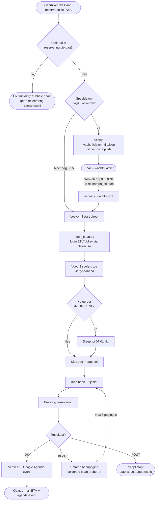
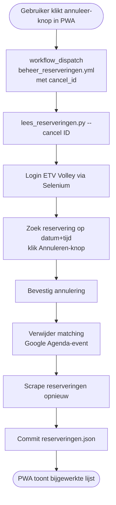
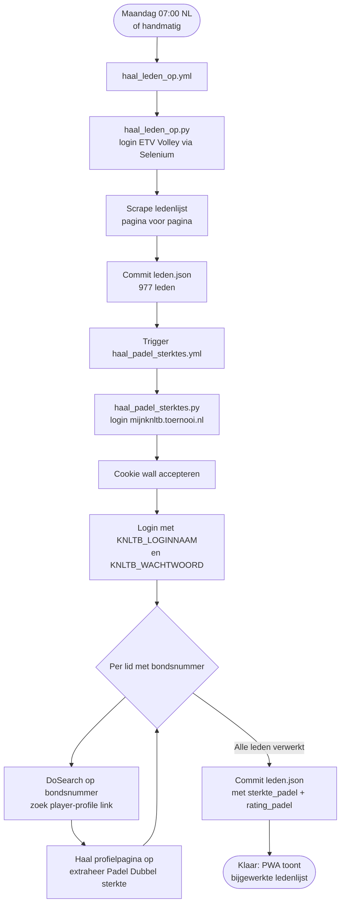
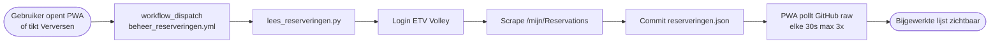

# knltb-autoboek -- Volledige documentatie

**GitHub-repository:** `joris-vandenBroek/knltb-autoboek`  
**Lokale locatie:** `\\MyCloudEX2Ultra\Transmission\ETV-Volley\knltb-autoboek`  
**Doel:** Automatisch een padelbaan reserveren bij ETV Volley via de KNLTB-ledenportal, aangestuurd via een PWA op de telefoon, inclusief Google Agenda-integratie en wachtrij voor toekomstige reserveringen.

---

## Inhoudsopgave

1. [Hoe werkt het in grote lijnen](#1-hoe-werkt-het-in-grote-lijnen)
2. [Visuele flows](#2-visuele-flows)
3. [Repository-structuur](#3-repository-structuur)
4. [Benodigde GitHub Secrets](#4-benodigde-github-secrets)
5. [Externe cron-trigger via cron-job.org](#5-externe-cron-trigger-via-cron-joborg)
6. [PWA-frontend -- docs/index.html](#6-pwa-frontend--docsindexhtml)
7. [Service Worker -- docs/sw.js](#7-service-worker--docsswjs)
8. [Workflows](#8-workflows)
9. [boek_baan.py -- stap voor stap](#9-boek_baanpy--stap-voor-stap)
10. [lees_reserveringen.py -- reserveringen + annuleren](#10-lees_reserveringenpy--reserveringen--annuleren)
11. [haal_leden_op.py -- ledenlijst scrapen](#11-haal_leden_oppy--ledenlijst-scrapen)
12. [haal_padel_sterktes.py -- padel speelsterktes ophalen](#12-haal_padel_sterktesppy--padel-speelsterktes-ophalen)
13. [Technische valkuilen en beslissingen](#13-technische-valkuilen-en-beslissingen)
14. [Wijzigingen aanbrengen](#14-wijzigingen-aanbrengen)
15. [Toekomstige features -- multi-user setup](#15-toekomstige-features--multi-user-setup)
16. [Operationele veiligheidsnetten](#16-operationele-veiligheidsnetten)

---

## 1. Hoe werkt het in grote lijnen

```
Gebruiker (telefoon)
        |  tikt op "Baan reserveren" in de PWA
        v
docs/index.html (GitHub Pages PWA)
        |  POST naar GitHub Actions API (met PAT-token)
        v
.github/workflows/boek.yml
        |  Start Python-script met datum/tijd/spelers
        v
boek_baan.py
        |  IF speeldatum > dag+2:
        |     -> schrijf wachtrij/<datum>_<tijd>.json + commit/push
        |  ELSE:
        |     -> login + spelers + (wacht tot 07:01 NL) + dag + baan + bevestig
        v
Klaar -- e-mail van ETV Volley

+----------------------------------------------------------+
| Voor wachtrij-items (dag+3 en verder):                   |
|                                                          |
| cron-job.org (06:50 NL dagelijks)                        |
|     |  POST naar GitHub Actions API                      |
|     v                                                    |
| verwerk_wachtrij.yml                                     |
|     |  Voor elk wachtrij-bestand met                     |
|     |  reserveringsdatum == vandaag:                     |
|     |     -> triggert boek.yml met die inputs            |
|     v                                                    |
| boek.yml -> boek_baan.py -> dag-keuze vanaf 07:01 NL    |
+----------------------------------------------------------+

beheer_reserveringen.yml -> Google Agenda sync (aanmaken + verwijderen)
```

De **ledenlijst** (`leden.json`) wordt los bijgehouden via `haal_leden_op.yml` (wekelijks of handmatig). Na een ledenlijst-refresh worden automatisch de **padel speelsterktes** opgehaald via `haal_padel_sterktes.yml`. Gebruikt door de PWA voor de speler-dropdowns.

De **actieve reserveringen** (`reserveringen.json`) worden bijgehouden via `lees_reserveringen.py` + `beheer_reserveringen.yml`, getriggerd vanuit de PWA bij Verversen of Annuleren.

Google Agenda-events worden gesynchroniseerd vanuit dezelfde flow: aanmaken voor reserveringen zonder event (ook als medespeler), verwijderen als een reservering verdwijnt.

---

## 2. Visuele flows

### Flow 1 -- Baan reserveren (direct of via wachtrij)



### Flow 2 -- Reservering annuleren



### Flow 3 -- Ledenlijst + padel speelsterktes bijwerken



### Flow 4 -- Timing op reserveringsdatum

```mermaid
gantt
    title Tijdlijn op de reserveringsdatum (speeldatum minus 2 dagen)
    dateFormat HH:mm
    axisFormat %H:%M

    section cron-job.org
    POST workflow_dispatch        :milestone, 06:50, 0m

    section boek_baan.py
    Login ETV Volley              :06:51, 2m
    Spelers toevoegen             :06:53, 3m
    Wachten tot 07:01             :06:56, 5m
    Kies dag + dagdeel            :07:01, 1m
    Kies baan + tijdslot          :07:02, 1m
    Bevestig                      :crit, 07:02, 1m
    Verifieer + Agenda-event      :07:03, 1m
```



### Flow 5 -- Reservering verversen (PWA)



---

## 3. Repository-structuur

```
knltb-autoboek/
|-- boek_baan.py                 # Hoofdscript: Selenium-reservering + wachtrij
|-- lees_reserveringen.py        # Scrape + annuleer actieve reserveringen
|-- haal_leden_op.py             # Scrape de ledenlijst -> leden.json
|-- haal_padel_sterktes.py       # Haal padel speelsterktes -> leden.json
|-- leden.json                   # Cache van alle ETV-leden met padel sterktes (~977 leden)
|-- reserveringen_<gebruiker>.json   # Cache van actieve reserveringen per gebruiker
|-- agenda_items_<gebruiker>.json    # Mapping reservering-ID -> Google Agenda event-ID
|-- wachtrij/                    # Reserveringen voor speeldatums > dag+2
|   |-- .gitkeep
|   \-- YYYY-MM-DD_HHMM.json     # Per ingeplande reservering
|-- docs/                        # PWA (GitHub Pages source)
|   |-- index.html               # Single-page app
|   |-- sw.js                    # Service Worker (cache versioning)
|   |-- manifest.json            # PWA-manifest
|   \-- logo.png + icon-192/512.png
\-- .github/workflows/
    |-- boek.yml                 # Voer een reservering uit
    |-- verwerk_wachtrij.yml     # Verwerk wachtrij (door cron-job.org getriggerd)
    |-- beheer_reserveringen.yml # Scrape of annuleer reservering (vanuit PWA)
    |-- haal_leden_op.yml        # Ledenlijst-refresh (maandag 07:00) + trigger padel sterktes
    |-- haal_padel_sterktes.yml  # Padel speelsterktes ophalen via mijnknltb.toernooi.nl
    \-- publiceer_pwa.yml        # Deploy docs/ naar GitHub Pages (alleen bij docs/**-wijzigingen)
```

GitHub Pages is ingesteld op de `docs/`-map van de `main`-branch, met `build_type: workflow` (GitHub Actions-deploy via `publiceer_pwa.yml`, niet de legacy branch-build). De PWA is bereikbaar via `https://joris-vandenbroek.github.io/knltb-autoboek/`.

---

## 4. Benodigde GitHub Secrets

In te stellen via **GitHub -> Repository -> Settings -> Secrets and variables -> Actions**:

### ETV Volley (etv-volley.nl)

ETV Volley credentials worden per gebruiker beheerd via `GEBRUIKERS_CONFIG`. Losse `ETVVOLLEY_BONDSNUMMER`/`ETVVOLLEY_WACHTWOORD` secrets zijn niet meer nodig — alle workflows (boek, beheer, haal_leden_op) lezen uit `GEBRUIKERS_CONFIG`.

### mijnKNLTB (mijnknltb.toernooi.nl)

| Secret | Inhoud |
|--------|--------|
| `KNLTB_LOGINNAAM` | Gebruikersnaam voor mijnknltb.toernooi.nl |
| `KNLTB_WACHTWOORD` | Wachtwoord voor mijnknltb.toernooi.nl |

### Overig

| Secret | Inhoud |
|--------|--------|
| `GOOGLE_CALENDAR_CREDENTIALS` | Volledige JSON-inhoud van het Service Account-sleutelbestand |
| `GOOGLE_CALENDAR_ID` | Agenda-ID (bijv. `primary` of e-mailadres) |
| `HEALTHCHECK_PING_URL` *(optioneel)* | Healthchecks.io check URL voor dead-man's-switch (zie sectie 16) |

Het **GitHub Personal Access Token (PAT)** wordt *niet* als Secret opgeslagen, maar:
- **In de PWA** in `localStorage` (sleutel `knltb_pat`) voor PWA-triggers (workflow_dispatch)
- **In cron-job.org** in een header voor de dagelijkse wachtrij-trigger

Beide PATs hebben minimaal `workflow` scope nodig (classic) of `Actions: Read and write` op deze repo (fine-grained).

---

## 5. Externe cron-trigger via cron-job.org

**Waarom extern?** GitHub Actions' eigen `schedule:`-triggers zijn best-effort en kunnen volledig overgeslagen worden, vooral bij nieuwe workflows of tijdens hoge load. cron-job.org is een externe service die wel deterministisch op tijd vuurt.

### Setup

1. **Classic PAT aanmaken** op [github.com/settings/tokens/new](https://github.com/settings/tokens/new):
   - Scope: alleen `workflow`
   - Expiration: bv. 1 jaar
2. **Account** op [cron-job.org](https://cron-job.org) -> Create cronjob:
   - **URL:** `https://api.github.com/repos/joris-vandenBroek/knltb-autoboek/actions/workflows/verwerk_wachtrij.yml/dispatches`
   - **Schedule:** Every day at **06:50**, timezone **Europe/Amsterdam**
   - **Request method:** POST
   - **Request body:** `{"ref":"main"}`
   - **Headers:**
     | Name | Value |
     |---|---|
     | `Authorization` | `Bearer ghp_...` |
     | `Accept` | `application/vnd.github+json` |
     | `X-GitHub-Api-Version` | `2022-11-28` |
     | `Content-Type` | `application/json` |
3. **Test run** -> moet 204 No Content geven

---

## 6. PWA-frontend -- docs/index.html

Een HTML-bestand zonder frameworks. Werkt als installeerbare PWA op iPhone en Android. Sectie-volgorde:

1. **Header** met ETV Volley-logo + tandwiel-knop voor PAT
2. **Wanneer** -- datumkiezer + tijdkeuze (08:00-21:30, stappen van 30 min, standaard 15:00) + Sport-selector (Padel/Tennis)
3. **Medespelers** -- 3 dropdowns met zoekfilter (PrimeFaces-stijl)
4. **Mijn reserveringen** -- actieve reserveringen + annuleren per item
5. **Ingeplande reserveringen** -- wachtrij + verwijderen per item
6. **Baan reserveren** -- vast onderaan, triggert workflow

### Mobile sizing

Basis font-size `22px` (op viewport < 380px: `20px`). Velden minimaal 58px hoog, knoppen 76px.

### Mijn reserveringen (PWA-card)

```javascript
const RESERV_URL = `https://raw.githubusercontent.com/${REPO}/main/reserveringen.json`;
```

- **Laden op page open:** fetch `reserveringen.json` van GitHub raw, render lijst.
- **Verversen:** workflow_dispatch op `beheer_reserveringen.yml` met `cancel_id=""` -> script logt in, scrape, commit/push. PWA pollt om nieuwe state te tonen.
- **Annuleer-knop per item:** confirm-dialoog -> workflow_dispatch met `cancel_id="YYYY-MM-DD_HHMM_baan-slug"`.

### Ingeplande reserveringen (wachtrij, PWA-card)

- Leest via Contents API (alleen files in `wachtrij/`).
- Toont per item: speeldatum, tijd, spelers, reserveringsdatum.
- Verwijderen via Contents API DELETE (geen workflow nodig).

### PAT-overlay

Verschijnt automatisch als `localStorage.knltb_pat` leeg is. PAT opgeslagen lokaal -- niet naar server gestuurd.

### Namen-check bij boeken

Vlak vóór de `workflow_dispatch`-aanroep in `boekBaan()` checkt `_vindDubbeleSpelers()` of een van de 4 spelers al voorkomt in een actieve of ingeplande reservering van *een van de gebruikers* uit `gebruikers.json` op dezelfde speeldatum (zie [13.9](#139-etv-1-actieve-reservering-rule-vermoeden)). Bij een treffer: foutmelding via toast met de dubbele naam/namen, en er wordt geen reservering aangemaakt. "Gefaalde" wachtrij-items (reserveringsdatum al gepasseerd zonder opruiming) tellen niet mee. Fail-open bij netwerkfouten of een timeout van 5s -- de check mag een legitieme boeking nooit blokkeren door eigen problemen.

---

## 7. Service Worker -- docs/sw.js

```javascript
const CACHE = 'padel-v59';
```

Elke keer dat `index.html` of `sw.js` inhoudelijk verandert moet dit versienummer omhoog. De SW verwijdert dan automatisch de oude cache bij activate.

### Cachestrategie per bestandstype

| Bestanden | Strategie | Reden |
|-----------|-----------|-------|
| `index.html`, `manifest.json`, `/` | **Network-first**, fallback cache | Updates direct zichtbaar |
| `sw.js`, `logo.png`, `icon-*.png` | **Cache-first** | Veranderen zelden |
| `leden.json` | **Cache-first** | Verandert zelden, beheerd door eigenaar |
| Al het overige (reserveringen, wachtrij, GitHub API) | **Altijd netwerk** | Stale data is actief schadelijk; offline is toch nutteloos |

> **Bewuste keuze:** data-caching is uit voor reserveringen en wachtrij. Offline werken heeft geen zin (boeken/annuleren vereist netwerk), en gecachte reserveringen leidden tot bugs waarbij annuleringen of updates onzichtbaar bleven.

---

## 8. Workflows

### 8.1 boek.yml

**Naam:** Reserveer baan  
**Trigger:** alleen `workflow_dispatch`.  
**Inputs:** `datum` (YYYY-MM-DD), `tijd` (HH:MM), `sport` (padel/tennis, default padel), `speler2`, `speler3`, `speler4`.

**Stappen:** checkout -> setup-python 3.11 -> apt-get install xvfb + pip install -> Xvfb :99 + python boek_baan.py -> bij fout: upload `*.png` als artifact (3 dagen retentie).

### 8.2 verwerk_wachtrij.yml

**Trigger:** `workflow_dispatch` (door cron-job.org) of `schedule` (GitHub-side fallback).

**Wat het doet:**
1. Lees `wachtrij/*.json`
2. Per bestand: bereken `reserveringsdatum = speeldatum - 2 dagen`
3. Als `reserveringsdatum == today` (NL-tijd): trigger `boek.yml` + verwijder bestand
4. Commit + push verwijderingen (retry-loop met rebase)

### 8.3 beheer_reserveringen.yml

**Trigger:** `workflow_dispatch` of `schedule` (dagelijks 07:30 NL).  
**Inputs:** `gebruiker` (gebruiker-ID of `'alle'`), `cancel_id` (optioneel).

**Twee-job structuur:**
1. **`setup`-job**: bepaalt matrix via `curl gebruikers.json | jq '[.[].id]'`. Bij `gebruiker='alle'` of schedule: alle gebruikers. Anders: één gebruiker.
2. **`beheer`-job**: draait parallel per gebruiker via `strategy.matrix`, `fail-fast: false`. Concurrency per gebruiker: `knltb-beheer-<gebruiker>`.

Run: `python lees_reserveringen.py` (of met `--cancel ID`). Schrijft `reserveringen_<gebruiker>.json` en commit.

**Google Agenda:** alleen als de gebruiker een `calendar_id` heeft in `GEBRUIKERS_CONFIG`. Geen fallback naar de gedeelde `GOOGLE_CALENDAR_ID` secret — voorkomt dat medegebruikers events aanmaken in elkaars agenda.

**pip cache:** `requirements.txt` in de root bevat de pip-dependencies; `actions/setup-python@v5` cachet ze tussen runs (~25s besparing).

### 8.4 haal_leden_op.yml

**Trigger:** `workflow_dispatch` of `schedule: '0 5 * * 1'` (07:00 NL maandag).  
**Na succes:** triggert automatisch `haal_padel_sterktes.yml` via `gh workflow run`.

### 8.5 haal_padel_sterktes.yml

**Trigger:** `workflow_dispatch` (handmatig of na `haal_leden_op.yml`).  
**Input:** `max_leden` (0 = alle leden, >0 = testrun).  
**Secrets:** `KNLTB_LOGINNAAM` + `KNLTB_WACHTWOORD`.

### 8.6 publiceer_pwa.yml

**Naam:** Publiceer PWA  
**Trigger:** `push` op `main` met `paths: ['docs/**']`, of handmatig via `workflow_dispatch`.

Bouwt en deployt de PWA (`docs/`) naar GitHub Pages via `actions/configure-pages` + `actions/upload-pages-artifact` + `actions/deploy-pages` (Pages-bron staat op `build_type: workflow`, niet meer de legacy branch-build). `concurrency: {group: "pages", cancel-in-progress: false}` zorgt dat opeenvolgende deployments in de rij staan i.p.v. racen. Zie [13.17](#1317-github-pages-legacy-build-raceerde-met-data-only-pushes-run-667668-06-07-2026) voor de aanleiding.

---

## 9. boek_baan.py -- stap voor stap

### Constanten

```python
LOGIN_URL     = "https://www.etv-volley.nl/mijn"
RESERVEER_URL = "https://www.etv-volley.nl/mijn/Reservations"
SPELER1       = "Joris van den Broek"
PADEL_BANEN   = ["Padel 1", ..., "Padel 6"]
TENNIS_BANEN  = ["Tennis 04", ..., "Tennis 12"]  # Smashcourt-courts (banen 04-12, geen 10)
```

`kies_baan_en_tijd` filtert op sport (padel: Padel 1-6, tennis: Smashcourt-courts 04-12).

### Wachtrij-pad

```python
reserveringsdatum = speeldatum - timedelta(days=2)
if nu.date() < reserveringsdatum.date():
    _zet_in_wachtrij(...)
    sys.exit(0)
```

### Direct-boek-pad

1. Login -- Cloudflare-wait, cookie-banner, JS-property setter
2. Klik "Baan afhangen"
3. Voeg 3 spelers toe via typeahead
4. Wacht tot 07:00:01 NL (alleen op reserveringsdatum)
5. Kies dag + dagdeel (retry-loop, max 150 pogingen, 0,15s cooldown, deadline 07:03:00 -- geen screenshots meer per poging)
6. Kies tijdslot (zoekt `.timeincourt` of `[data-hour]` cellen)
7. Bevestig (intercepteert jQuery.ajax POST naar `/Ajax/Profile/SaveReservation`)
8. Verifieer op `/mijn/Reservations`

### bevestig + BEZET-retry

| Return | Betekenis |
|---|---|
| `'OK'`    | Reservering geslaagd |
| `'BEZET'` | Race-conditie -> retry met andere baan (max 6x) |
| `'FOUT'`  | Andere fout -> script stopt |

Na BEZET: `driver.get(ReservationsCourt)` + `driver.refresh()` voor verse DOM (bezette tijdcellen verdwijnen dan uit de DOM).

---

## 10. lees_reserveringen.py -- reserveringen + annuleren

### Werking

Zonder argumenten: scrape `/mijn/Reservations`, schrijf `reserveringen.json`, commit/push.

Met `--cancel <id>`: annuleer die reservering op ETV-site. Als de ETV-annulering slaagt, wordt het matching Google Agenda-event direct verwijderd. Bij mislukken blijft het agenda-event bewust staan (geen vals-negatief verwijdering). Daarna scrape opnieuw.

### ID-format

`YYYY-MM-DD_HHMM_baan-slug`, bijv. `2026-05-31_1500_padel-1`.

### Scrape-heuristieken

1. Tabel-rijen -- alle `<tr>` met >=2 `<td>` cellen
2. Class-based divs -- `[class*="booking|reservation"]`
3. Cancel-buttons -- knoppen met tekst/class `annuleer|cancel|verwijder`

### Google Agenda-synchronisatie

`maak_ontbrekende_agenda_items(reserveringen)` wordt na elke scrape aangeroepen en synchroniseert in twee richtingen:

| Situatie | Actie |
|---|---|
| Reservering bestaat, nog geen event | Event aanmaken in Google Agenda |
| Reservering verdwenen (geannuleerd door anderen) | Event verwijderen uit Google Agenda |
| Annuleren via PWA (`--cancel ID`) | Event direct verwijderd via event-ID lookup |

**Idempotentie:** event-IDs worden opgeslagen in `agenda_items_{GEBRUIKER}.json`. Bij een volgende run worden al-bestaande events niet opnieuw aangemaakt.

**Voordeel t.o.v. aanmaken in boek_baan.py:**
- Reserveringen waarbij je **medespeler** bent (aangemaakt door iemand anders) krijgen ook een agenda-event
- Annuleringen door anderen buiten de PWA worden **automatisch** opgeruimd
- Encoding-veilig: titels via `chr()`, geen literal emoji/dashes in de broncode

**Agenda-titel formaat:** `ETV Padel – Padel 3` of `ETV Tennis – Tennis 07`

---

## 11. haal_leden_op.py -- ledenlijst scrapen

1. Login via Selenium/UC
2. Klik "Ledenlijst"-tab
3. Scrape namen uit eerste tabelkolom
4. Paginering -- klik paginanummer N+1, fallback "Volgende"
5. Fallback per letter als <10 namen
6. Sorteer + schrijf `leden.json` + commit/push

Na succes triggert de workflow automatisch `haal_padel_sterktes.yml`.

---

## 12. haal_padel_sterktes.py -- padel speelsterktes ophalen

### Doel

Vult `sterkte_padel` en `rating_padel` in `leden.json` voor elk lid met een Padel Dubbel speelsterkte op mijnknltb.toernooi.nl.

### Strategie

Geen Selenium -- mijnknltb.toernooi.nl heeft geen Cloudflare-bescherming. Pure `requests.Session` volstaat.

### Login-flow (mijnknltb)

1. **Cookie wall:** GET `/cookiewall?returnurl=/user/login` -> POST acceptatie
2. **Login-pagina:** GET `/user/login` -> extraheer `__RequestVerificationToken`
3. **Login-POST:** veld heet `Login` (niet `Username`!), plus `Password`, `__RequestVerificationToken`, `ReturnUrl`
4. **Verificatie:** URL mag niet meer `/login` of `/cookiewall` bevatten

### DoSearch endpoint

```
GET /find/player/DoSearch?Query={bondsnummer}&Page=1&SportID=0
X-Requested-With: XMLHttpRequest
```

Retourneert HTML met `href="/player-profile/{guid}"` links.

### Padel sterkte extractie

```python
r'title="Padel Dubbel"[^>]*>.*?'
r'<span class="tag-duo__title">(.*?)</span>.*?'
r'<span class="tag-duo__value">(.*?)</span>'
```

### Output in leden.json

```json
{
  "naam": "Toine Aanraad",
  "bondsnummer": "12345678",
  "sterkte_padel": "7",
  "rating_padel": "7,3215"
}
```

---

## 13. Technische valkuilen en beslissingen

### 13.1 Cloudflare-omzeiling (ETV Volley)

`undetected-chromedriver` past Chrome aan zodat `navigator.webdriver` faalt. Geen `--headless` -- headless laat detecteerbare signatures achter. Xvfb simuleert een echt scherm.

### 13.2 isTrusted=true noodzakelijk

ETV's jQuery-handlers filteren `isTrusted=false` events weg. ActionChains.move_to_element + click is verplicht voor spelers-suggesties, daypart-elementen en tijdslot-cellen.

### 13.3 GitHub Actions cron is onbetrouwbaar

Bewezen: de eerste productie-nacht vuurde de cron simpelweg niet.  
**Oplossing:** [cron-job.org](https://cron-job.org) verstuurt workflow_dispatch events, die GitHub wel betrouwbaar honoreert.

### 13.4 Recent mee gespeeld race condition

Brede XPath-fallback matchte het "Recent mee gespeeld" paneel -- speler werd dan met een verkeerde click-handler gekoppeld en nooit server-side geregistreerd.  
**Fix:** alleen `role=option`, `<li>` en `<div class=player/suggestion/result/item>`.

### 13.5 Foute speler-selectie (Christel-incident)

XPath `contains(., 'Waardenburg')` matchte een container met meerdere namen.  
**Fix:** strikte text-equality op het te klikken element zelf.

### 13.6 Push-race-conditions

Vier bronnen pushen naar main. Alle push-plekken hebben een retry-loop met `git pull --rebase`.

### 13.7 Cron timing vs boekvenster

Login + spelers loopt tijdens de wachttijd voor 07:00. Vanaf 07:00:01 NL: kies_dag -> kies_baan -> bevestig in een doorloop.

### 13.8 Boekvenster geldt vanaf dag-keuze, niet alleen bevestig

Run #63 bewees dat ETV's server de daypart-selectie zelf weigert voor 07:00. Sleep staat daarom vlak voor `kies_dag`.

### 13.8b ETV weigert dag-selectie nog ~1-2 min na 07:00 (run #174, 05-07-2026)

Log van run #174 liet zien dat `kies_dag` vanaf 07:00:01 tientallen keren achter elkaar werd geweigerd (bleef op `ReservationsDay`) en pas rond 07:01:30-07:02:30 werd geaccepteerd -- ruim ná de toenmalige deadline van 07:01:30. De code escaleerde daardoor naar een outer-retry mét een vaste `time.sleep(30)`, waardoor de daadwerkelijke boeking pas om 07:02:44 bevestigd werd (bijna 3 min na 07:00). Vermoeden: andere leden zonder deze vertraging waren sneller bij het gewenste tijdslot (20:00 was al bezet, uitgeweken naar 21:00).

Aangepast:
- `dag_deadline` van 07:01:30 → **07:03:00**, `MAX_DAG_POGINGEN` van 50 → **150** zodat de goedkope binnenlus blijft doorproberen i.p.v. te escaleren.
- Cooldown tussen pogingen van 0,5s → **0,15s**.
- `WebDriverWait` na "Volgende" van 1,5s → **1,0s** (poll_frequency 0,1s).
- Kleine sleeps in `kies_dag` van 0,3s → **0,15s**.
- Screenshots per sub-poging (`dag_fout_poging`, `terug_naar_spelers_poging`, `geen_nav_poging`, `kies_dag_definitief_fout`) **verwijderd** -- kostten disk-I/O per poging, diagnose kan ook via de tekst-logregels (zie 13.8c).
- De vaste `time.sleep(30)` bij een outer-retry wordt **overgeslagen** zodra spelers al zijn ingevoerd (`spelers_gedaan == True`) -- die 30s was alleen bedoeld om ETV tijd te geven na een volledige wizard-herstart, niet als er enkel opnieuw dag-selectie nodig is.

### 13.8c Ruwe Actions-logs ophalen voor timing-diagnose

`gh` (GitHub CLI) is geïnstalleerd op de werkplek. Run-nummer -> run-id opzoeken en filteren op tijdstip/patroon:

```powershell
gh run view <run-of-run-id> --repo joris-vandenBroek/knltb-autoboek --log |
  Select-String -Pattern "kies_dag|Dag-selectie|BOEK-POGING|Op baankeuze"
```

Zo is de exacte seconde-voor-seconde timing van een boekpoging te reconstrueren zonder dat er losse screenshots nodig zijn.

### 13.9 ETV "1 actieve reservering"-rule (vermoeden)

ETV lijkt geen 2e actieve reservering toe te staan per lid. Niet 100% gevalideerd.

**Mitigatie:** de PWA voorkomt dit sinds 2026-08 proactief met een namen-check vóór het aanmaken van een 2e reservering op dezelfde dag (zie sectie 6, "Namen-check bij boeken").

### 13.10 Spelers selecteren via UUID (data-id)

Selectie via `.addPlayer[data-id]` exact gelijk aan geaccepteerde naamvorm. Verificatie via `#youPlayWith` op die specifieke data-id.

### 13.11 Race-conditie: andere boeker pakt de baan

`bevestig()` retourneert `'BEZET'` bij patronen als "niet gevonden" / "al gereserveerd". Main() doet max 6 retries met driver.refresh() voor verse DOM.

### 13.12 Typeahead substring-matches (Daniel-bug)

Hover-event tijdens ActionChains voegde "Ellen Daniels" toe bij zoekterm "Daniel Enderink".  
**Fix:** `_ruim_onverwachte_spelers_op()` scant en verwijdert alles buiten de verwachte data-id set na elke speler-add.

### 13.13 mijnKNLTB login -- veldnaam 'Login', niet 'Username'

mijnknltb.toernooi.nl gebruikt veldnaam `Login` in het ASP.NET Identity formulier. Vereist ook eerst cookie wall acceptatie. Credentials los van ETV Volley: `KNLTB_LOGINNAAM` + `KNLTB_WACHTWOORD`.

### 13.14 YAML encoding-corruptie door PowerShell Set-Content

PowerShell's `Set-Content -Encoding utf8` schrijft een UTF-8 BOM. GitHub Actions herkent dan `workflow_dispatch` niet meer. Bovendien corrupteert het emoji-tekens in shell `run:` blokken.  
**Fix:** schrijf YAML-bestanden altijd met de Write-tool (Claude Code) of met `[System.IO.File]::WriteAllText` met `UTF8Encoding($false)`. Gebruik geen emoji in YAML.


### 13.15 ETV toont datums als DD-MM-YYYY, niet ISO

ETV Volley rendert datums in de reserverings-pagina als `DD-MM-YYYY` (bijv. `24-06-2026`), niet als `YYYY-MM-DD`. De reserverings-ID's in de code gebruiken wel ISO-formaat.  
**Fix:** `annuleer()` in `lees_reserveringen.py` berekent zowel `doel_datum_iso` als `doel_datum_nl` en accepteert beide in de JS-rijselectie.

### 13.16 UTF-8 BOM breekt Python op Linux

PowerShell's `[System.IO.File]::WriteAllBytes` met `UTF8.GetBytes()` schrijft een BOM-loze UTF-8. Maar `WriteAllText` en `Set-Content -Encoding utf8` schrijven wel een BOM. Python op Linux (GitHub Actions) weigert bestanden die beginnen met BOM (`U+FEFF`) met `SyntaxError`.  
**Fix:** altijd `[System.IO.File]::WriteAllBytes(C:\Users\broek01\knltb-autoboek\knltb-autoboek.md, [System.Text.Encoding]::UTF8.GetBytes(# knltb-autoboek -- Volledige documentatie

**GitHub-repository:** `joris-vandenBroek/knltb-autoboek`  
**Lokale locatie:** `\\MyCloudEX2Ultra\Transmission\ETV-Volley\knltb-autoboek`  
**Doel:** Automatisch een padelbaan reserveren bij ETV Volley via de KNLTB-ledenportal, aangestuurd via een PWA op de telefoon, inclusief Google Agenda-integratie en wachtrij voor toekomstige reserveringen.

---

## Inhoudsopgave

1. [Hoe werkt het in grote lijnen](#1-hoe-werkt-het-in-grote-lijnen)
2. [Visuele flows](#2-visuele-flows)
3. [Repository-structuur](#3-repository-structuur)
4. [Benodigde GitHub Secrets](#4-benodigde-github-secrets)
5. [Externe cron-trigger via cron-job.org](#5-externe-cron-trigger-via-cron-joborg)
6. [PWA-frontend -- docs/index.html](#6-pwa-frontend--docsindexhtml)
7. [Service Worker -- docs/sw.js](#7-service-worker--docsswjs)
8. [Workflows](#8-workflows)
9. [boek_baan.py -- stap voor stap](#9-boek_baanpy--stap-voor-stap)
10. [lees_reserveringen.py -- reserveringen + annuleren](#10-lees_reserveringenpy--reserveringen--annuleren)
11. [haal_leden_op.py -- ledenlijst scrapen](#11-haal_leden_oppy--ledenlijst-scrapen)
12. [haal_padel_sterktes.py -- padel speelsterktes ophalen](#12-haal_padel_sterktesppy--padel-speelsterktes-ophalen)
13. [Technische valkuilen en beslissingen](#13-technische-valkuilen-en-beslissingen)
14. [Wijzigingen aanbrengen](#14-wijzigingen-aanbrengen)
15. [Toekomstige features -- multi-user setup](#15-toekomstige-features--multi-user-setup)
16. [Operationele veiligheidsnetten](#16-operationele-veiligheidsnetten)

---

### 13.15 ETV toont datums als DD-MM-YYYY, niet ISO

ETV Volley rendert datums in de reserverings-pagina als `DD-MM-YYYY` (bijv. `24-06-2026`), niet als `YYYY-MM-DD`. De reserverings-ID's in de code gebruiken wel ISO-formaat.  
**Fix:** `annuleer()` in `lees_reserveringen.py` berekent zowel `doel_datum_iso` als `doel_datum_nl` en accepteert beide in de JS-rijselectie.

### 13.16 UTF-8 BOM breekt Python op Linux (GitHub Actions)

PowerShell's `WriteAllText` en `Set-Content -Encoding utf8` schrijven een UTF-8 BOM (byte `0xEF 0xBB 0xBF`). Python op Linux weigert bestanden die beginnen met BOM met `SyntaxError: invalid non-printable character U+FEFF`.  
**Fix:** altijd `[System.IO.File]::WriteAllBytes($p, [System.Text.Encoding]::UTF8.GetBytes($c))` gebruiken (geen BOM), of de Write-tool van Claude Code.

### 13.17 GitHub Pages legacy-build raceerde met data-only pushes (run #667/#668, 06-07-2026)

De PWA (`docs/`) draaide op de **legacy branch-build** van GitHub Pages, die op *elke* push naar `main` herbouwt -- ook bij commits die `docs/` helemaal niet raken (wachtrij-cleanup, boekstatus, `reserveringen_<gebruiker>.json`). `docs/index.html` haalt die data toch al rechtstreeks op via `raw.githubusercontent.com`/`api.github.com`, buiten Pages om -- een rebuild daarvoor is dus pure ruis.

Na een boeking pushen `boek.yml` (2 eigen commits) en het getriggerde `beheer_reserveringen.yml` (1 commit) vlak na elkaar. Twee van die pushes triggerden bijna gelijktijdig een Pages-build; de nieuwste kreeg `Deployment failed, try again later` van GitHub's Pages-API omdat de vorige nog aan het afbreken was.

**Fix:** Pages-bron omgezet naar `build_type: workflow` (via `PUT /repos/{owner}/{repo}/pages -f build_type=workflow`) + nieuwe [`publiceer_pwa.yml`](#86-publiceer_pwayml) die alleen bij `docs/**`-wijzigingen bouwt, met een `concurrency`-group als extra vangnet. Data-only commits raken de Pages-build nu helemaal niet meer.

---

## 14. Wijzigingen aanbrengen

### Speler 1 wijzigen

In `boek_baan.py`:
```python
SPELER1 = "Joris van den Broek"
```

### Standaard tijd / tijdsbereik

In `docs/index.html`:
```javascript
tijdEl.value = '15:00';
```

### Boekvenster-timing wijzigen

In `boek_baan.py`, vlak voor de dag-selectielus:
```python
doel_window_open = reserveringsdatum.replace(hour=7, minute=0, second=1, microsecond=0)  # 07:00:01
dag_deadline     = reserveringsdatum.replace(hour=7, minute=3, second=0, microsecond=0)  # 07:03:00
MAX_DAG_POGINGEN = 150
```
Zie [13.8b](#138b-etv-weigert-dag-selectie-nog-1-2-min-na-0700-run-174-05-07-2026) voor de aanleiding van deze waarden.

### Cron-tijd wijzigen

In cron-job.org -> cronjob -> tab Schedule. Niet in `verwerk_wachtrij.yml` editen.

### Nieuwe versie van de PWA uitrollen

1. Wijzig `docs/index.html`
2. Bump `CACHE` in `docs/sw.js`: `const CACHE = 'padel-v47';`
3. Commit + push

### Site-redesign van ETV Volley

Diagnose via screenshots (artifacts bij failed run):

| Screenshot | Moment |
|------------|--------|
| `01_login_pagina.png` | Loginpagina geladen |
| `02_na_login.png` | Direct na inloggen |
| `03_reserveer_pagina.png` | Reserveringen-overzicht |
| `04_na_afhangen_klik.png` | Na klikken "Baan afhangen" |
| `05_spelers_pagina.png` | Spelers-pagina geladen |
| `06_spelers_toegevoegd.png` | Na toevoegen alle spelers |
| `07_dag_pagina.png` | Dag-keuze pagina |
| *(geen per-poging screenshot meer)* | `kies_dag`-retries maken sinds de timing-optimalisatie (13.8b) geen screenshot meer per sub-poging -- kostte te veel tijd in de tijdkritieke 07:00-lus. Diagnose via `gh run view --log` (zie 13.8c) |
| `09_baan_pagina.png` | Baan/tijdslot-pagina |
| `10_baan_geselecteerd.png` | Na tijdslot-klik |
| `11_bevestig_pagina.png` | Confirm-pagina |
| `12_na_bevestiging.png` | Na bevestig-klik |

---

## 15. Toekomstige features -- multi-user setup

**Status: geïmplementeerd** -- zie de [Multi-user setup](#multi-user-setup) sectie in README.md voor de actuele opzet via `GEBRUIKERS_CONFIG`.

### 15.1 Architectuur

Per-user secrets in dezelfde repo:

| Secret | Voor |
|---|---|
| `ETVVOLLEY_BONDSNUMMER_JORIS` / `ETVVOLLEY_WACHTWOORD_JORIS` | Joris's ETV-login |
| `ETVVOLLEY_BONDSNUMMER_TOINE` / `ETVVOLLEY_WACHTWOORD_TOINE` | Toine's ETV-login |
| `GOOGLE_CALENDAR_ID_JORIS` / `GOOGLE_CALENDAR_ID_TOINE` | Per-user agenda |

### 15.2 Workflow-wijzigingen

```yaml
env:
  ETVVOLLEY_BONDSNUMMER: ${{ inputs.gebruiker == 'toine' && secrets.ETVVOLLEY_BONDSNUMMER_TOINE || secrets.ETVVOLLEY_BONDSNUMMER_JORIS }}
  ETVVOLLEY_WACHTWOORD:  ${{ inputs.gebruiker == 'toine' && secrets.ETVVOLLEY_WACHTWOORD_TOINE  || secrets.ETVVOLLEY_WACHTWOORD_JORIS }}
  SPELER1_NAAM:          ${{ inputs.gebruiker == 'toine' && 'Toine Aanraad' || 'Joris van den Broek' }}
```

### 15.3 Python

```python
SPELER1 = os.environ.get("SPELER1_NAAM", "Joris van den Broek")
```

### 15.4 Data-isolatie

| Was | Wordt |
|---|---|
| `reserveringen.json` | `reserveringen_joris.json` + `reserveringen_toine.json` |
| `wachtrij/<datum>.json` | `wachtrij/joris/<datum>.json` + `wachtrij/toine/<datum>.json` |
| `leden.json` | Blijft gedeeld |

### 15.5 Effort-inschatting

| Onderdeel | Tijd |
|---|---|
| 3 workflow-files -- input + conditional env | 15 min |
| Python-scripts parametrize | 15 min |
| verwerk_wachtrij per-user loop | 10 min |
| File-rename + wachtrij-folder | 10 min |
| PWA gebruiker-selector + dynamic URLs | 15 min |
| Docs | 10 min |
| Per nieuwe gebruiker: secrets + Google Calendar-deling | ~5 min |
| **Totaal eenmalige refactor** | **~1.5 uur** |

---

## 16. Operationele veiligheidsnetten

### 16.1 Concurrency-groepen

```yaml
concurrency:
  group: knltb-account-joris
  cancel-in-progress: false
```

Serialiseert runs op account-niveau. `cancel-in-progress: false` zodat een lopende boeking niet halverwege wordt afgekapt.

### 16.2 Auto-issue bij failure

Elke workflow heeft een `if: failure()` step die via `gh issue create` een GitHub Issue opent met run-link en label `auto-failure,<bron>`.

### 16.3 Healthchecks.io dead-man's-switch (optioneel)

`verwerk_wachtrij.yml` pingt `/start`, success-URL of `/fail` als `HEALTHCHECK_PING_URL` gezet is. Alert na 24u stilte -- vangt stille failures op (PAT verlopen, cron-job.org down, GitHub outage).

### 16.4 Wachtrij-TTL

Items ouder dan **60 dagen** worden verwijderd zonder boeking-trigger.

### 16.5 Dry-run modus

`boek_baan.py --dry-run`: alle stappen behalve de daadwerkelijke bevestig-klik. Via PWA: amber toggle boven de Reserveer-knop.

### 16.6 PAT-expiry waarschuwing (PWA)

Badge op tandwiel-icoon: amber bij 8-30 dagen, rood bij 0-7 dagen, pulsend rood na verloop.

### 16.7 Spelers 2-poging retry

Per speler maximaal 2 pogingen. Bij fail: `driver.refresh()` + retry. Defensieve cleanup bewaart eerder-toegevoegde spelers.

---

## 17. Wachtrij-opruiming -- twee plekken

### 17.1 Primaire cleanup (boek.yml)

Na een succesvolle boeking verwijdert `boek.yml` (stap "Ruim wachtrij-bestand op") het bestand `wachtrij/<gebruiker>/<datum>_<tijdslug>.json` op basis van de *input-tijd*. Dit werkt correct als de boeking op de voorkeurstijd slaagt.

### 17.2 Secundaire cleanup (lees_reserveringen.py `ruim_wachtrij_op()`)

Wordt aangeroepen na elke scrape (dagelijkse cron + handmatig verversen). Vergelijkt wachtrij-items met gescrapete reserveringen.

**Match-logica:** vergelijk op `datum` + `spelers` (set van namen). De tijd wordt bewust NIET gebruikt als criterium, want bij een race-conditie boekt het script automatisch een alternatieve tijd -- de geboekte tijd verschilt dan van de wachtrij-tijd, maar datum en spelers zijn identiek.

**Achtergrond:** op 2026-06-16 slaagde een boeking voor 20:00 op 20:30 (alle banen op 20:00 bezet). Het wachtrij-bestand bleef aanvankelijk staan omdat de exacte tijdmatch faalde.